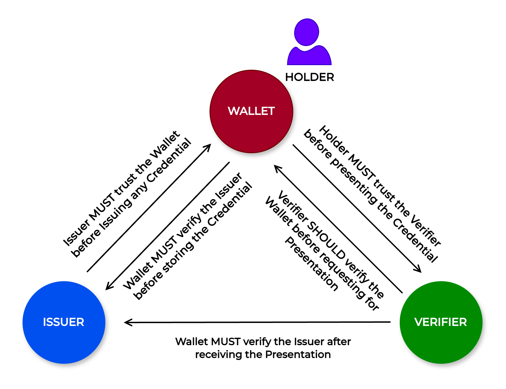

# 4 Key Digital Functionalities


The Key Digital Functionalities (KDFs) describe the core (required) functions that this building block must be able to perform. These functionalities should be described as business processes as opposed to technical specifications or API definitions.

The KDFs provide an overview of the functionality that should be provided by the Building Block. These KDFs should be organized by area of functionality and should be numbered so that they can be referenced in other sections.

Note, that any assumptions or context that are needed for this Building Block should be provided in Section 2 (Description)


## 4.1. Privacy Considerations

### 4.1.1. Unobservability

Here, [unobservability](3-terminology.md#unobservability) means that neither wallet providers nor issuers shall be able to track where a holder uses his/her credentials or learns details concerning the attributes provided.

* The wallet (backend) should not be able to track where the credentials are being presented or learn details about the attributes of any transactions performed by the Holder
* The issuer should not be involved in the presentation process
* The issuer should not be able to learn details of the presentation when there is a status check of the credentials by a Verifier

### 4.1.2. Unlikability

Issuance and presentation protocols should support [unlinkability](3-terminology.md#unlinkability) and ensure that cryptographic keys and random numbers cannot be used as correlation identifiers, this also includes less obvious data fields such as timestamps or version numbers.

Below are are few scenarios for unlikability.

* Any outside entity should not be able to link two transactions to the same Holder
* A verifier should not be able to link two presentations to the same holder (unless the holder's information is provided as part of the presentation)
* An issuer should not be able to link two issuance transactions to the same holder (unless the holder provides information as part of the holder's authentication)
* Two verifiers should not be able to link two presentation transactions to the same holder by sharing the received presentations
* Two issuers should not be able to link two issuance transactions to the same holder by sharing the received information during the issuance
* An issuer and a verifier should not be able to link an issuance and presentations session to the same holder (unless the Holder provides sufficiently identifying information as part of their authentication to the Issuer and as part of the presented credential shared with the verifier)

### 4.1.3. Repudiation

Here, [repudiation](3-terminology.md#repudiation) is the ability to deny the transaction to third parties without affecting the reliability of the transaction where the verifier was involved.

* **Holder deniability**\
  After receiving a presentation the verifier should not be able to prove to any third party that the holder had presented the credentials to the verifier for identification purposes earlier.&#x20;
* **Deniability of Data Authenticity**\
  The verifier should not be able to prove to any third party the authenticity of the credential and the integrity of its attributes that the verifier had previously verified.

### 4.1.4. Data Minimisation

To ensure that minimal data is shared with the verifier, the wallet should incorporate various features so that the holder shares only the required data with the verifier for a specific transaction. A few of these features are,

*   **Selective Disclosure**

    The wallet (with the holder's consent) should be able to present a selected subset of the data fields (claims) from a credential while other fields are not revealed to the verifier.
* **Pseudonymity**\
  The wallet should enable the holder to present a pseudonym instead of their real identity when authenticating online or presenting credentials, except in cases where legal identification is mandatory.

### 4.1.5. Consent

The wallet should capture the holder's consent before the credentials are presented to any verifier.

## 4.2. Security Considerations

### 4.2.1. Holder Binding

The ability of the holder to prove legitimate possession of a verifiable credential. There can be multiple types of holder binding. Here, we have defined three types of holder binding.

#### 4.2.1.1. Cryptographic Holder Binding

In cryptographic holder binding, issued credentials are cryptographically bound to the identifier of the Holder who possesses the credentials. Cryptographic binding allows the verifier to verify during the presentation of a credential that the holder presenting the credential is the same holder to whom that credential was issued in the first place.

This is possible as the Holder uses the same private key during the issuance and presentation.


The mechanism of performing cryptographic holder binding might depend on the type of Credential Format.


#### 4.2.1.2. Claim-based Holder Binding

In claims-based binding, no cryptographic binding identifier is provided. Instead, the issued credential includes the Holder's claims that can be used by the Verifier to verify possession of the credential by requesting the presentation of existing forms of physical or digital identification that include the same claims.

#### 4.2.1.3. Biometrics-based Holder Binding

In biometrics-based binding, the Verifier should be able to authenticate the Holder using a certain biometric trait (such as fingerprint or face) when the biometric data is available in the verifiable credentials.

### 4.2.2. Secure Storage

The wallet must provide a secure environment to,

* Store sensitive credential information by implementing secure cryptographic techniques
* Store the keys
  * Used for encrypting the credential data
  * Used for cryptographically binding the holder with the credentials

### 4.2.3. Trust Infrastructure

In a digital credentialing ecosystem, the trust infrastructure is vital for ensuring trust and transparency within the trust triangle (Issuer-Holder-Verifier).

<figure><figcaption></figcaption></figure>

* The issuer should be able to verify that the credential is shared with a trusted Wallet
* The wallet must verify that a trusted Issuer issued the credentials
* The wallet should be able to verify that the presentation is shared with a trusted verifier
* The verifier must verify that a trusted Issuer issued the credentials

### 4.2.4. Handle Replay Attacks

For every verification request, the wallet should generate a new presentation. The presentation should be bound to the presentation request sent by the verifier to prevent the replay of presentations.

## 4.3. Credential lifecycle management

### 4.3.1. Credential Discovery 

A wallet holder who intends to receive credentials from an issuer should be able to get relevant information on how to download the credentials, so that, the process of credential issuance is convenient and secure.

### 4.3.2. Credential Issuance 

An Issuer should be able to issue digitally verifiable credentials with a trusted Wallet.

Key considerations during credential issuance:

* The Issuer should trust the wallet before sharing the credentials
* The Issuer should verify the holder's details before issuing credentials
* The wallet should validate the issuer's details to make sure that a trusted issuer issued the credentials
* The wallet should validate the received credentials before storing the credentials

### 4.3.3. Credential Statuses

The status of a credential is dynamic and is governed by the issuer or the owner of the credential.

* The Issuer should be able to change the status of the credentials
* The Issuer should provide a privacy-preserving way to check the status so that the Verifier can check if the credential is suspended or revoked

### 4.3.4. Credential Validity

The wallet and the verifier should be able to verify the validity of the credentials. Validity of credentials means, that&#x20;

* The credential signature is verified
* The credential has not expired
* A trusted issuer issues the credential

### 4.3.5. Presenting a Credential

The wallet should be able to present a credential to a Verifier upon receiving a request from the Verifier.

Key considerations while sharing a presentation:

* The wallet should trust the verifier before sharing the credentials
* The wallet should generate a new presentation for every request
* The wallet should collect the consent of the holder before sharing the presentation

## 4.4. Other features

### 4.4.1. Portability

The wallet should be able to provide a mechanism for the holder to port credentials from one device to another (when the credentials are locally stored in a device).

While doing so, the credentials need to be bound in the new device, hence, the wallet should provide a mechanism to cryptographically bind the credentials to the holder in the new device.

### 4.4.2. Transaction logs

The wallet should maintain a comprehensive log displaying details on various actions performed on the credentials in the wallet with timestamps. Some of the key events in the wallet are,

* Downloading a credential in the wallet
* Sharing a credential with a verifier
* Removing a credential from the wallet

### 4.4.3. Handling revoked and expired credentials

The wallet should be able to identify expired and revoked credentials and promptly notify the holder to take appropriate actions.

### 4.4.4. Removing a credential from the wallet

The holder should be able to remove a credential from the wallet.

