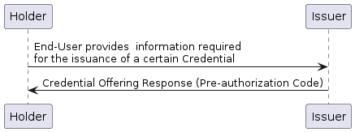

# 9 Internal Workflows


This section describes standard _internal_ workflows that a building block should support. Each internal workflow must be linked to one of the Functional Requirements defined in section 6.

An internal workflow describes the internal processes that a Building Block needs to execute to complete a request from an external application or Building Block to fulfill the functional requirement


## 9.1. Credential Issuance

### 9.1.1. Credential Issuance via. Authorization Code Flow

This workflow follows the authorization code flow of the OAuth 2.0 authorization framework to authenticate the Holder and then issue a Verifiable Credential.

In this workflow, the Holder initiates the request using the Wallet and authenticates via the Issuer's authorization endpoint. Once authentication is completed and consent is given, the Issuer provides an authorization code, as specified in \[[RFC6749](https://www.rfc-editor.org/rfc/rfc6749.html)], to issue access tokens. The Wallet can then use the access token to retrieve the credential from the Issuer by calling the credential issuance endpoint.

<figure><figcaption></figcaption></figure>

<details>

<summary>PlantUML Source</summary>

```plant-uml
@startuml
Holder -> Wallet: Holder selects a credential type\nfrom the list of credential types
Wallet -> Issuer: Authorization request\n(for the type of credential to be issued)
group Enduser authentication & consent
Issuer -> Holder: Authentication Challenge
Holder -> Issuer: Challenge Response
Issuer -> Holder: Consent Request
Holder -> Issuer: Consent Response
end
Issuer -> Wallet: Authorization response (code)
Wallet -> Issuer: Token request (code)
Issuer -> Wallet: Token response (Access Token)
Wallet -> Issuer: Credential Request \n(Access Token, proof(s))
Issuer -> Wallet: Credential Response \n(Credential(s) OR Transaction ID)
@enduml
```

</details>

### 9.1.2. Credential Issuance via. Pre-authorization Code Flow

This workflow follows the pre-authorization code flow of the OAuth 2.0 authorization framework. Before interacting with the Wallet, the Credential Issuer generates a Verifiable Credential for the Holder and provides a pre-authorization code. The Holder uses this pre-authorization code to obtain the Credentials in the Wallet which is shared as part of the token endpoint to receive an access token, which is then used to retrieve the credentials.


The business process for generating the Verifiable Credentials and retrieving the pre-authorization code is out of the scope of this specification.


<figure><figcaption></figcaption></figure>

<details>

<summary>PlantUML Source</summary>

```plant-uml
@startuml
Holder -> Issuer: End-User provides  information required\nfor the issuance of a certain Credential
Issuer -> Holder: Credential Offering Response (Pre-authorization Code)
@enduml
```

</details>

<figure><figcaption></figcaption></figure>

<details>

<summary>PlantUML Source</summary>

```plant-uml
@startuml
Holder -> Wallet: Interacts and shares the pre-authorization code
Wallet -> Issuer: Token request\n(pre-authorization code, tx_code)
Issuer -> Wallet: Token response (Access Token)
Wallet -> Issuer: Credential Request \n(Access Token, proof(s))
Issuer -> Wallet: Credential Response \n(Credential(s) OR Transaction ID)
@enduml
```

</details>

## 9.2. Presenting a Credentials

### 9.2.1. Presenting Credential on the Same Device

In this workflow flow, the Holder presents the credential to a Verifier that is present on the same device where the Holder's Wallet resides.

<figure><figcaption></figcaption></figure>

<details>

<summary>PlantUML Source</summary>

```plant-uml
@startuml
Holder -> Verifier: Interacts with Verifier
Verifier -> Wallet: Authorization Request
group Holder authentication & consent
Wallet -> Holder: Authentication Challenge
Holder -> Wallet: Challenge Response
Wallet -> Holder: Consent Request
Holder -> Wallet: Consent Response
end
Wallet -> Wallet: Generate Verifiable\nPresentation
Wallet -> Verifier: Authorization Response \n(VP Token with Verifiable Presentation(s))
@enduml
```

</details>

### 9.2.2. Presenting Credentials Cross Device

In this workflow, the Holder presents the credential to a Verifier interacting with the Holder on a different device from the device where the Wallet resides.

In this flow, the Verifier prepares an Authorization Request and renders it as a QR code. The User then uses the Wallet to scan the QR code to obtain the request URI. Using the request URI, the Wallet retrieves the presentation definition, authenticates the Holder, and captures consent to generate the Verifiable Presentation. The Verifiable Presentations are then sent to the Verifier.

<figure><figcaption></figcaption></figure>

<details>

<summary>PlantUML Source</summary>

```plant-uml
@startuml
Holder -> Verifier: Interacts with Verifier
Verifier -> Wallet: Authorization Request
Wallet -> Verifier: Respond with Request Object\n(Presentation Definition)
group Holder authentication & consent
Wallet -> Holder: Authentication Challenge
Holder -> Wallet: Challenge Response
Wallet -> Holder: Consent Request
Holder -> Wallet: Consent Response
end
Wallet -> Wallet: Generate Verifiable\nPresentation
Wallet -> Verifier: Authorization Response as HTTP POST\n(VP Token with Verifiable Presentation(s))
@enduml
```


</details>
